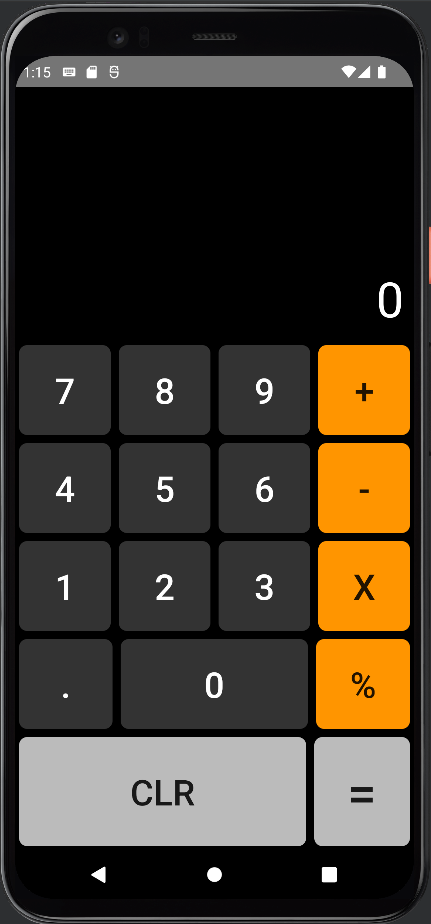
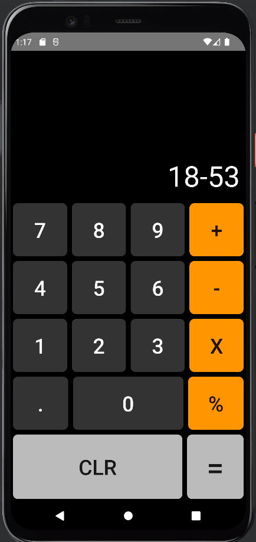
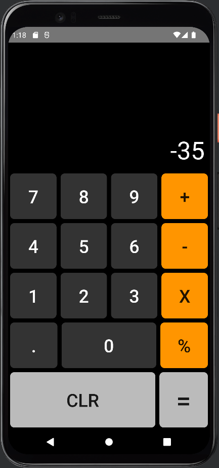

# Calculator App

This is a simple calculator app built for Android devices. It provides basic mathematical operations such as addition, subtraction, multiplication, and division, along with a clear button to reset the input.

## Screenshots

## Screenshots

  
  

## Features

- Addition: Perform addition operations between numbers.
- Subtraction: Perform subtraction operations between numbers.
- Multiplication: Perform multiplication operations between numbers.
- Division: Perform division operations between numbers.
- Clear: Reset the input and start fresh.

## Theme

The calculator app follows a sleek and modern theme with a vibrant color scheme. The user interface is designed to be intuitive and user-friendly, providing an enjoyable experience for users of all levels.
